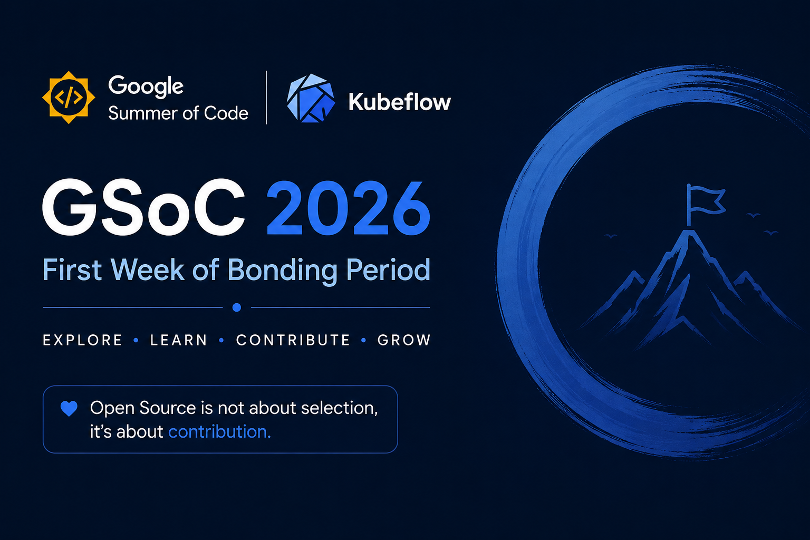

# My First Week of the GSoC 2026 Bonding Period with Kubeflow

Getting selected for Google Summer of Code 2026 with Kubeflow is a moment I will always remember.

This bonding period has already made me reflect on the journey from the day I started contributing to open source. I still remember the excitement when my first PR got merged. It felt great knowing that even a small contribution could become part of something used by the wider tech community.

After continuing to contribute and learn from the community, getting selected for GSoC became a major milestone for me. But one thing I have realized is that open source is much bigger than GSoC itself. GSoC is only a part of the journey; the real value comes from learning, collaborating, contributing, and growing with the community.

Currently, the bonding period is going on, and my mentors have encouraged me to explore the codebase deeply, understand the architecture, and discuss ideas that could simplify things for users. Honestly, it has been exciting to explore new parts of the project and experiment with the codebase.

A lot of people ask me whether this journey is difficult or how I managed to do it. My answer is simple: nothing comes easy. Consistency matters more than anything else. Small efforts repeated every day make a huge difference over time.

Looking forward to learning more, contributing more, and making the most out of this journey with Kubeflow and GSoC 2026. I will also be sharing weekly updates about my GSoC journey and learnings.

## Connect With Me

- LinkedIn: [LinkedIn-Sameer-yadav](https://www.linkedin.com/in/sameer-yadav-ab7280341/)

